# 347Conteneurs
# Documentation d'installation de l'environnement de developpement.
## **Objectifs et consignes:** Cmder, Git, VSC, Docker Desktop.
--------------------------------------------------------------------------
## **Objectifs**
À l'aide des sources proposées ci-dessous, installer différents outils proposés:
* Cmdr,
* Git,
* Visual Studio Code,
* Docker Desktop.

## **Livrable**
La documentation d'installation favorise:
* Une documentation basée sur des lignes de commandes en mentionnant les INUTS et les OUTPUT attendus.
* Des captures d'écran lorsque les lignes de commmandes ne sont pas possible
* Une documentation de résolution d'éventuelles panne.

**Source du document initial:** `[Source](https://ivanskodje.com/how-to-set-system-path-environment-variable-in-windows-10/)`
                                             
## **Cmder – Utilitaire de ligne de commande.**
### Context  
Cmder est un logiciel créé à cause de la pure frustration face à l’absence de jolis  émulateurs de consoles sur Windows. 
C’est donc un  émulateur de terminal pour Windows.
### Ce qu'on va faire
* **`[Télécharger](https://cmder.app/)`**
* Choisir la version mini (nous installerons *git* dans un second temps)
* Bien mettre à jour la variable d'environnement "*PATH*"
* En t'aidant de **`[cette documentation](https://github.com/cmderdev/cmder#shortcut-to-open-cmder-in-a-chosen-folder)`**, 
* fais en sorte que "*cmder*" s'ajoute au menu contextuel de l'explorateur de Windows. 

### Test d'acceptations
* Valider que la variable "PATH" a bien été mise à jour:
Utiliser la commande *`cmder`* pour ouvrir le prompt cmder.
(Dans l'exemple du prof il fallait mettre run cmder mais run n'est pas reconnu)
* Il faut valider que les raccourcis cmder ont bien été intégré dans l'explorateur de windows:
Pour ça il faut faire un clique-droit sur un dossier quelconque et *Cmder Here* sera dans les options.

## **1.Cmder - Installation de *Cmder* ** et paramétrage de variable d'environnement**
### Context
L'objectif est de pouvoir ouvrir/lancer *Cmder.exe* via laligne de commande, peut importe le chemin du répertoire.
En effet, sans l'ajout de la *variable d'environnement du chemin système*, 
il n'est pas possible d'exécuter Cmder.exe en dehors du fichier dans lequel il se trouve.
Dans cet exemple on va découvrir comment installer et exécuter **cmder** à partir de la ligne de commande.
On peut le faire avec n'importe quel fichier exécutable.

### Marche à suivre
1. Télécharger le *Cmder.exe* en version mini et le décompresser. 
Voici une image d'à quoi ressemble le dossier décompressé.
 


2. Ouvrir l'invite de commande en tant qu'administrateur 
(en faisant un clique-droit sur le terminal dans l'explorateur windows).
Avec  le terminal, se positionner dans le dossier cmder avec le chemin d'accès via la commande
`cd C:\cmder_mini` Là où j'ai mis "C:\cmder_mini", il faut le remplacer par le chemin d'accès du dossier sur ton ordi.
Tu peux le trouver en allant sur le dossier cmder, en cliquant sur la partie sélectionnée sur l'image et en copiant le chemin d'accès qui se trouve en haut.

3. 
 
~~3. Ensuite il faut sauvegarder le chemin d'accès en écrivant cette ligne de code `.\cmder.exe /REGISTER ALL`~~  
~~Et enfin lancer la commande `cmder.exe` pour ouvrir l'app.~~
### PROBLÈME! 
ça ne marche pas car la variable d'environnement PATH n'a pas encore été configurée
pour indiquer à windows où se trouve le dossier `"C:\cmder_mini"`. On passe donc à la partie 2.

## **2.Cmder - Paramétrage de variable d'environnement** 
### Contexte
Les **"Variables d'environnement système"**, 
appelée la variable d'environnement du chemin système,
est utilisée dans le contexte de l'exécution des fichiers.exe via la ligne de commande 
ou la fenêtre PowerShell.

### Marche à suivre
* Même étapes qu'avant: télécharger en mini, décompresser, se souvenir du chemin d'accès.
On l'a déjà fait donc je le compte pas.
1. Dans le champ **Rechercher** du menu Démarrer, taper *envi* 
et ouvrir la page **Modifier les variables d'environnement système**, puis sélectionner Variable d'environnement
Dans la nouvelle fenêtre, aller dans le menu Variables système.
Sélectionner la ligne commençant par **PATH** et cliquer sur **Modifier**.
2. Dans la nouvelle fenêtre, cliquer sur **Nouveau** 
puis **Parcourir** pour sélectionner le dossier **cmder** qui contient le fichier exécutable de l’application. 
Une nouvelle ligne  avec le chemin complet de l’application cmder s’ajoute à la liste 


3. Cliquer 3 fois ok pour fermer les fenêtres de configuration ouvertes.
4. Ouvrir **l'invite de commande** ou **PowerShell**. Si c'est déjà ouvert, faut le refermer et le rouvrir (toujours en admin).
taper `cmder.exe` et appuyer sur Entrée.
5. L'exécution de la commande ci-dessus ouvre le terminal **Cmder**.


Faire des mises à jour si besoin.
_6. Dans le cas d'une mise à jour qui ne marche pas, comme dans le cas ici-bas._

__

_Ce cas précis démontre un problème connu lors de la mise à jour d'anciennes versions de Clink._
_La mise à jour a partiellement fonctionné mais l'ancien programme de mise à jour contient un bug:_
_Il ne sait pas gérer le sous-dossiers themes\ qui a récemment été introduit._
_(Le code de mise à jour s'exécute à partir de l'ancienne version installée sur la machine.)_
Pour finaliser la mise à jour:
* Fermer Cmder.
* Ouvrir une simple invite de commande en tant qu'administrateur
~~* Aller dans le dossier où Clink est installé, il est normalement dans le dossier **vendor**~~ 
~~dans le dossier **Cmder_mini** qu'on a décompressé avant.~~ _ça n'aura servi à rien_.
* Aller sur la [page des releases GitHub de Clink](https://github.com/chrisant996/clink/releases)
* Télécharger le fichier `.zip` de la dernière version


* Le décompresser (via extraire tout)
* Ouvrir le fichier téléchargé, sélectionner tout ce qu'il y a dedans (par exemple en faisant CTRL + A)
* Copier tout les fichiers et les coller dans le dossier **Clink** qui se trouve dans le dossier **Cmder_mini**.
* Quand ça propose de **remplacer** les fchiers qui ont le même noms, choisir **Remplacer les fichiers dans la destination**. C'est ça qui va tout mettre à jour.
* Ouvrir **Cmder**
* Taper `clink update`
C'est à jour.

## **3.Cmder - Raccourci pour ouvrir Cmder dan un dossier choisi**  
### Marche à suivre
1. ouvrir un terminal en tant qu'administrateur.
2. Accéer au répertoire dans lequel on a placé _Cmder_ 
En remettant le bon chemin d'accès "C:\cmder_mini" via la commande
`cd C:\cmder_mini` dans le terminal en mode admin.
3. Exécuter `.\cmder.exe /REGISTER ALL`
C'est cette commande qui va permettre l'option d'ouvrir Cmder automatiquement 
lors d'un clique-droit dans un dossier ou sur le bureau de l'explorateur Windows.
4. Dans une fenêtre d'explorateur de fichiers, faites un clic-droit dans ou sur
un répertoire pour voir "Cmder Here" dans le menu.

### 3.Cmder - Test d'acceptation
1. Valider que l variable "PATH" a bien été mise à jour en tapant cette commande `cmder`
Normalement ça va ouvrir le prompt cmder.
2. Valider que les raccourcis cmder ont bien été intégré dans l'explorateur de Windows


        
## **Gestion de versioning**
** 1. Git - outil de gestion de version**
### Context
Git est un système de contrôle de version distribué gratuit et open source conçu 
pour gérer tout, des petits aux très grands projets, avec rapidité et effcacité.
* **[Télécharger](https://git-scm.com/)** 
* Prendre la version *"Standalone Installer"* 
* Laisser tous les paramètres par défaut (durant l’installation) 

## **2. Git - installer** 
### Marche à suivre
1. Lancer l'exécutable et ~~cliquer sur Entrée 13 fois de suite.~~
* *À noter que certains des paramètres par défaut ne sont plus exactement les mêmes que sur la source originale.*
* *Il se peut aussi que l'exécutable saute toutes les entrées à part la proposition initiale de l'installation.*
2. Cliquer sur Install et attendre qu'elle s'installe.

### Tests d'acceptations
* Petit contexte rapide:
Un exemple de test d'acceptation:


Dans la rédaction de codage de Cmder, on écrit --INPUT ou --OUTPUT pour expliquer
ce qui est tapé ( -- INPUT) et ce que la console affiche ( ---OUTPUT).
Le symbole λ n'est pas à taper, Il est déjà sur Cmder.
C'est une norme qui est propre à Cmder pour faire joli.

1. Lancer une nouvelle instance de Cmder et exécuter la commande ci-dessous.
_UNIQUEMENT CE QUI EST ENTRE ``_
-- INPUT 
`git --version`

--OUTPUT
`git version 2.55.0.windows.5`

2. Se rendre dans un répertoire dédié pour le développement <pathToMyDevFolder>
et exécuter la commande `git init` pour initialiser un nouveau dépôt.
* Créer un répertoire dédié en tapant `mkdir Projet347Conteneurs` (ou n'importe quel nom). 
**mkdir** vient de _Make directory_, ce qui veut dire créer un dossier.
* Puis taper `cd Projet347Conteneurs` pour switcher sur ledit dossier. 
**cd** pour change directory.
* taper `git init` pour créer un nouveau dépôt **Git** à partir de là on pourra l'envoyer sur Github..
On reçoit la réponse `Initialized empty Git repository in C:/Users/noork/Projet347Conteneurs/.git/`
Maintenant on est `C:\Users\noork\Projet347Conteneurs (master)`
3. Lister le contenu du répertoire dans lequel Git a été initialisé.
--INPUT
`ls -la` (ls pour liste les fichiers et -la pour afficher tous les fichiers, y compris les cachés) 
--OUTPUT
```
total 12
drwxr-xr-x 1 noork 197609 0 août  21 22:42 ./
drwxr-xr-x 1 noork 197609 0 août  21 22:37 ../
drwxr-xr-x 1 noork 197609 0 août  21 22:42 .git/
```


## **Visual Studio Code "VSC"  -  Visual Studio Code – Éditeur de code**
## **1.Visual Studio Code - Éditeur de code "VSC"**
### Contexte
Visual Studio Code est un éditeur de code source léger mais puissant qui s'exécute sur le bureau.
Il est disponible pour Windows, MacOS et Linux. Livré avec une prise en charge intégrée
de _Javscript_, _Typescript_ et _Node.JS_, il dispose d'un riche écosystème d'extensions pour
d'autres langages et environnements d'exécution (ex: _C++, C#, Python, PHP, Go, .NET_)

### Ce qu'on va faire
* [Télécharger](https://code.visualstudio.com/download?_exp_download=fb315fc982)
* Installer la version pour Windows (Lancer l'installeur avec exécutable)
* Ajouter l'extension pour [Docker](https://marketplace.visualstudio.com/items?itemName=ms-azuretools.vscode-docker)
* Ajouter l'exension pour [Markdown](https://marketplace.visualstudio.com/items?itemName=yzhang.markdown-all-in-one)
* Ajouter l'extension pour [Markdown to PDF](https://marketplace.visualstudio.com/items?itemName=yzane.markdown-pdf)
### Marche à suivre
1. Télécharger/Installer VSCode
* Lancer l'exécutable téléchargé, accepter le contrat de License, Cliquer sur **Suivant**
jusqu'à la fenêtre **Prêt à installer** puis cliquer **Installer**
* Attendre la fin de l'installation et cliquer sur Terminer. VSCode devrait se lancer automatiquement.
Si c'est pas le cas, le faire manellement.
2. Extesion Docker
* Ajouter l'extension pour [Docker](https://marketplace.visualstudio.com/items?itemName=ms-azuretools.vscode-docker)
* Dans la page d'accueil de l'application VSC, sélectionner l'icône des extensions.
Rechercher **Docker** et cliquer sur **installer**

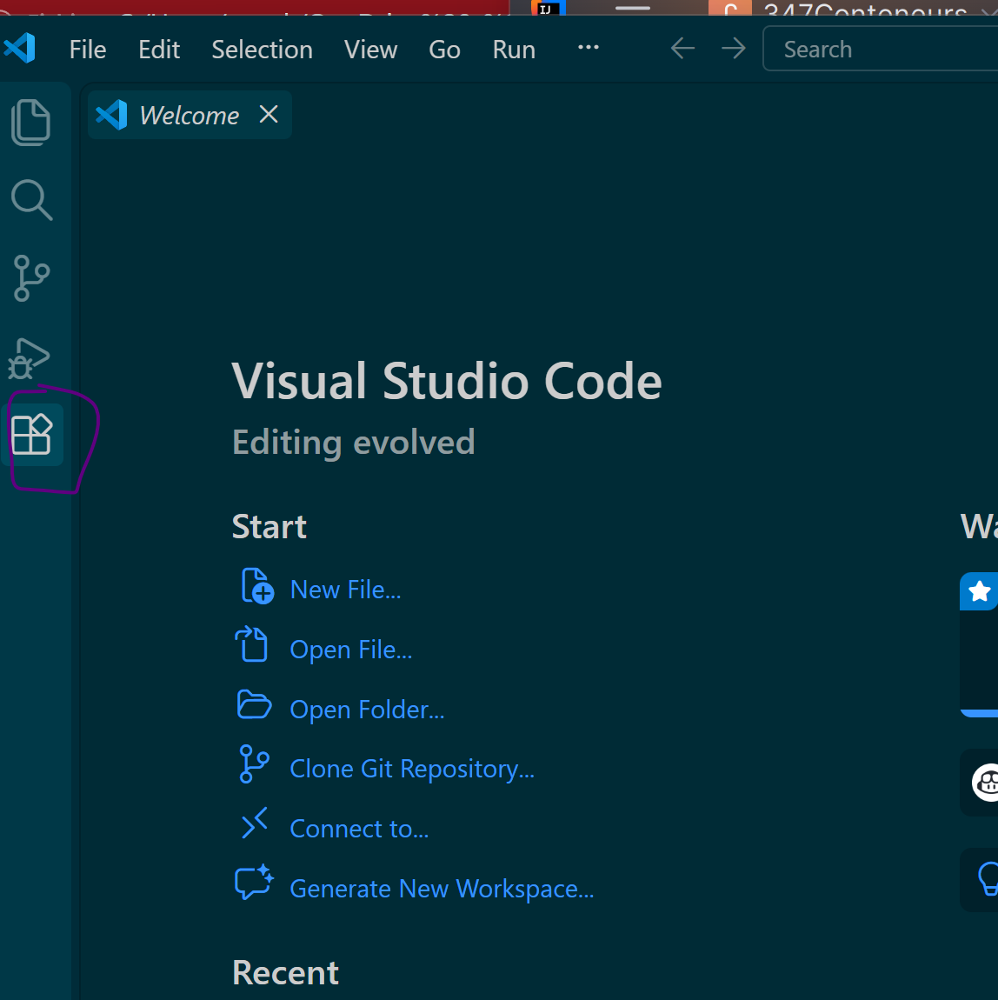

3. Ajouter Extension Markdown
* Faire pareil qu'avec Docker. **Cliquer sur Trut publisher and install**.
* 4. Ajouter l'extension pour l'impression [Markdown pdf](https://marketplace.visualstudio.com/items?itemName=yzane.markdown-pdf)

## **2.Option - configurer cmder comme terminal par défaut dans VSC**
### Marche à suivre
* Ouvrir Visual Studo Code
* Appuyer sur "CTRL + SHIFT + p"
* Puis écrire "**open user settings**" et choisir le "**user settings JSON **"
  (c'est normal que > soit mis automatiquement avant notre text)

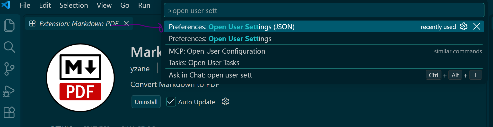

et **ajouter ce contenu** en respectant la structure du json existant:
Aussi mettre à jour le **chemin** pointant vers mon installation __<PathToYourCmderInstallation>__
```
{
    "terminal.integrated.profiles.windows": {
        "Cmder": {
            "path": "${env:windir}\\System32\\cmd.exe",
            "args": ["/k", "<PathToYourCmderInstallation>\\cmder\\vendor\\init.bat"] 
        }
    },
    "terminal.integrated.defaultProfile.windows": "Cmder"
}
```
Voici ci-dessous mon fichier json à la première ouverture:

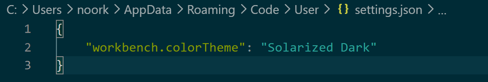
              
Voici ci-dessous mon fichier json après avoir inséré le text écrit:


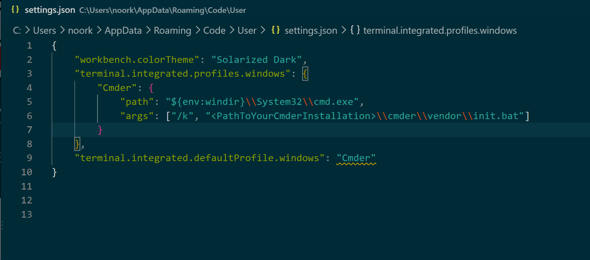

Voici ci-dessous mon fichier json avec le bon chemin écrit:
 
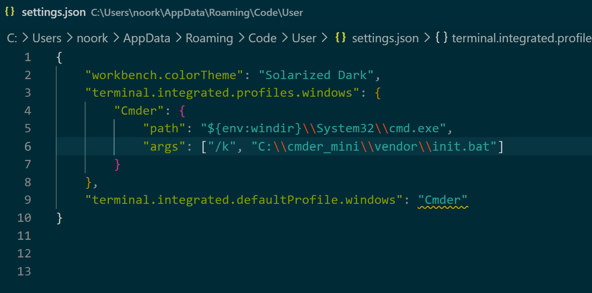

Sauvegarder et quitter.


* Tester l'installation en ouvrant un terminal VSCode 
(**Terminal**, **Nouveau terminal**) et tapant le code `ls -la`
Voici le résultat attendu:

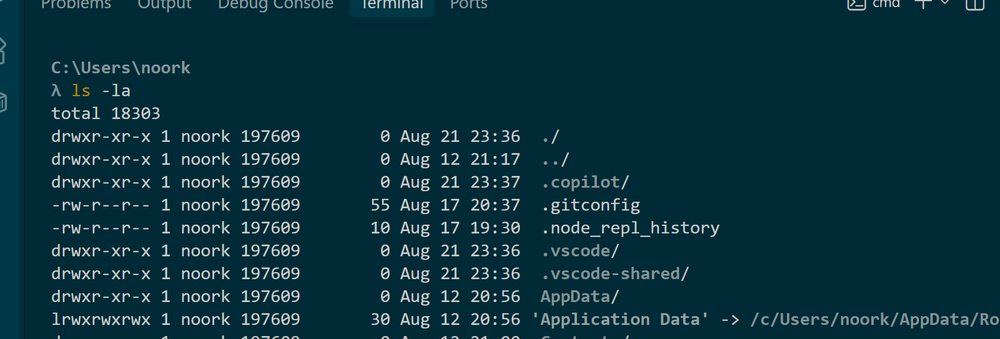

## **Dessiner son architecture   -   Eraser – Architecture designer**
## **1.Eraser - Architecture designer**
### Context
All-in-one markdown editor, collaborative canvas and diagram-as-code builder

### Ce quon va faire
* [Télécharger l'extension pour visual studio code]([https://marketplace.visualstudio.com/items?itemName=EraserLabs.eraserlabs](https://marketplace.visualstudio.com/items?itemName=EraserLabs.eraserlabs))
*La procédure d'installation d'une extension dans Visual Studio Code est identique:
### Marche à suivre
* Dans la page d’accueil (interface) de Visual Studio Code, sélectionner l’icône des extensions 
* Dans le champ de recherche en haut à droite sous EXTENSIONS : MARKETPLACE, 
saisissez le mot clé correspondant à l’extension " _Eraser_" et cliquer sur **Installer**.

## **2.Prise en main de l'outil**

**Petite parenthèse quant à comment lier le nom "1KB sample.eraserdiagram"
à un fichier qui se télécharge au clique.**
* **Ajouter** à la racine de mon projet **le fichier "sample.eraserdiagram"** qu'on a préalablement téléchargé.
* En bas de l'IDE ou via le menu en haut, checher l'onglet **Git** pour **ouvrir** le panneau de contrôle de version.
* Dans l'onglet **Git**, aller dans la section **Uncommitted changes** ou **Changes**.
* On devrait y voir notre fichier **sample.eraserdiagram**.
* il faut le **commit** et le **push** sur **Github**.
* Aller sur mon dépôt sur **Github**.
* Aller **sur** le fichier **sample.eraserdiagram** dans le dossier **docs**.
* Sélectionner **Raw**.
ça va ouvrir une page avec seulement le **contenu brut** du fichier.
* **Copier l'URL** du haut de la page:

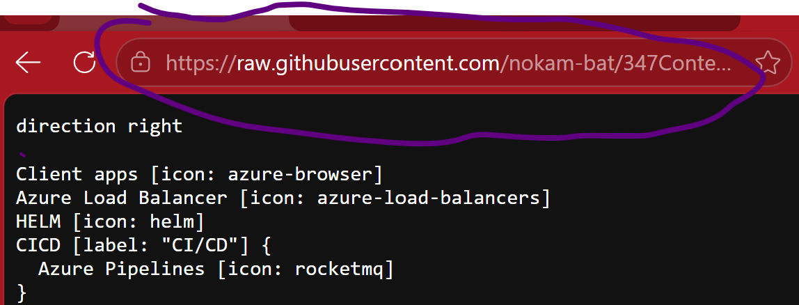

* Enfin, **coller l'URL** dans l'**insertion de lien**:

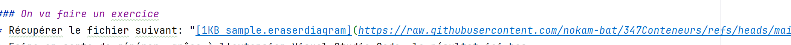

C'est fait!

### On va faire un exercice
* Récupérer le fichier suivant: "[1KB sample.eraserdiagram](https://raw.githubusercontent.com/nokam-bat/347Conteneurs/refs/heads/main/docs/sample.eraserdiagram)"
* Faire en sorte de générer, grâce à l'extension Visual Studio Code, le résultat ici-bas.


source: [eraser.io](docs/sample.eraserdiagram) 

* En regardant la [documentation intégrée avec l'extension](https://docs.eraser.io/diagram-as-code), 
on doit identifier et ajouter le bon type de diagram comme première ligne pour que ça fonctionne.

**Diagram syntax**
La première ligne du fichier determine le type de diagram parmis lesquels sont:
``` 
cloud-architecture-diagram
entity-relationship-diagram
sequence-diagram
flow-chart
``` 
**Voici la syntax pour chacun des diagram**
On peut les trouver sur la **page d'extension** d'Eraser **surVSCode**:

* [Cloud architecture diagram](https://docs.eraser.io/architecture-diagram-syntax)
* [Entity relationship diagram](https://docs.eraser.io/erd-syntax))
* [Sequence diagram](https://docs.eraser.io/sequence-diagram-syntax)
* [Flow chart](https://docs.eraser.io/flow-chart-syntax)


### Marche à suivre:
* Télécharger le fichier mentionné.
* Ouvrir VSCode et s'assurer de fermer tous les onglets afin d'avoir l'espace vide.
L'app devrait ressembler à ça:

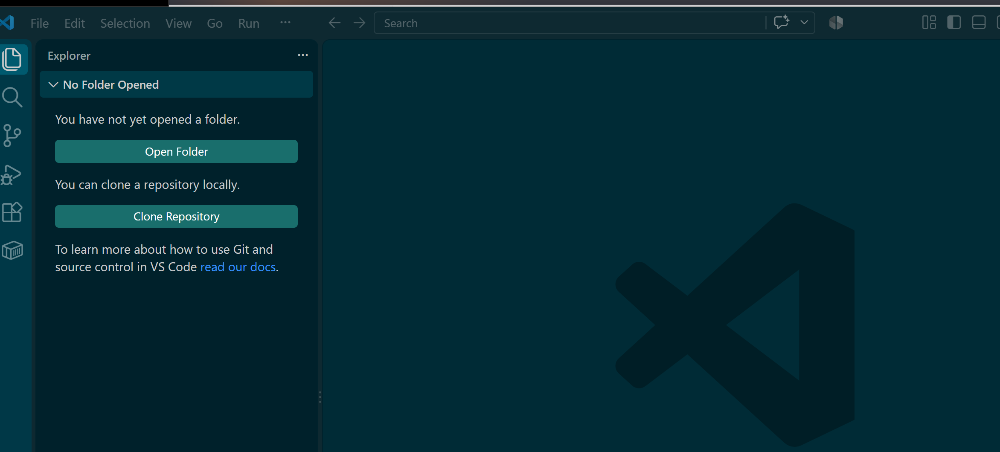

* Cliquer sur **fchier** puis **open file** 
et sélectionner le fichier qu'on vient de télécharger.
* Cliquer sur **faire confiance** au fichier et d'**afficher** (si ça le demande)
* L'app devrait ressembler à ça:

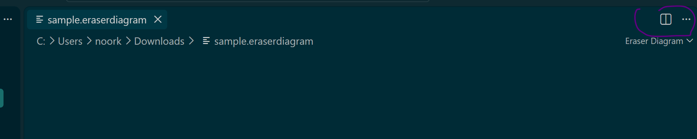

* Pour que le document s'affiche correctement, 
il faut **cliquer** sur les **trois points** en haut à droite de l'écran
puis sur **Reopen editor with** et enfin sur **text editor**.
* Voici à quoi devrait ressembler le document:

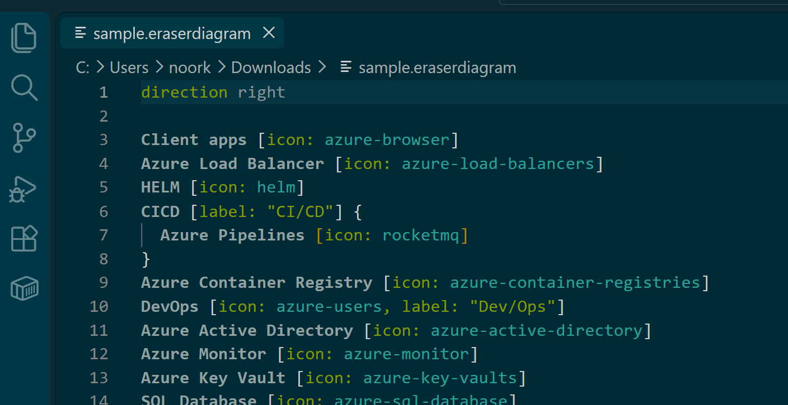

**Maintenant, pour que _l'extension Eraser_ reconnaise qu'il s'agit d'un _diagramme d'architecture_
et qu'elle _affiche le dessin_ visuel à côté, il faut _déclarer_ le _type de diagramme_
tout en haut ou juste après la direction.**
* Pour ça, il faut d'abord identifier à quel type de diagram on a à faire.
* Pour ça on observe le **diagram du Professeur**:

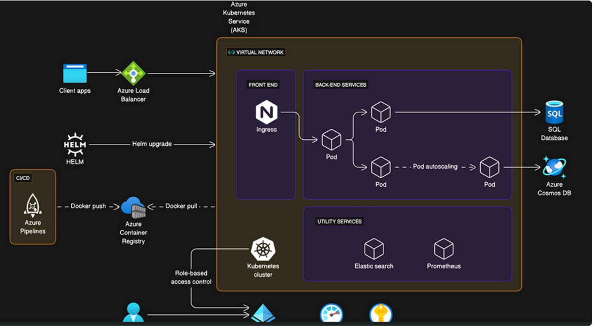

*Puis on **compare** l'**affichage** avec les affichages de tous les **types d'architetures**.
* Pour cela, il faut **cliquer** un à un sur **chacun des liens** explicatifs de chaque **diagram**.
soit en retournant les chercher sur la page d'extension d'Erser sur VSCode,
**soit en cliquant sur les liens que j'ai partagé plus haut dans la doc d'intro à Eraser.**
*Comme on peut voir dans la fiche de **syntax** de la page "**Architecture diagram syntax**",
ça a l'air de correspondre avec notre **code**.
* On test l'hypothèse en **tapant** en haut du fichier `cloud-architecture-diagram`, avant ou après `direction right`.
* On **enrengistre** avec "Ctrl + S"
* On clique sur le **"livre"** en haut à droite de l'écran de **VSCode**
ça va rajouter une deuxième partition du même code à côté de celui sur lequel on est.
C'est pratique pour avoir **le code et le diagram affichés** en même temps.
* Ensuite on **clique** sur les **trois points** à droite du **"livre"**
* On **clique** sur **"reopen editor"** puis sur **"Eraser Diagram"**
Voici juste en dessous d'une image pour mieux illustrer:

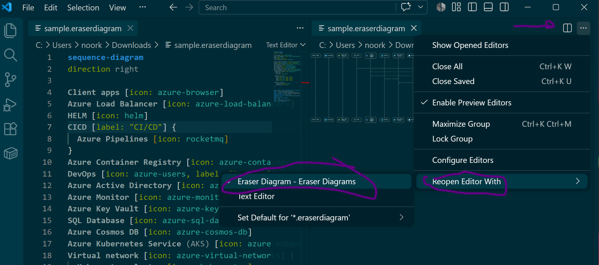
*Ne pas faire attention à la mauvaise ligne de code que j'ai mis qui a mal affiché le diagram*

Maintenant, ça devrait s'afficher comme ici-bas!

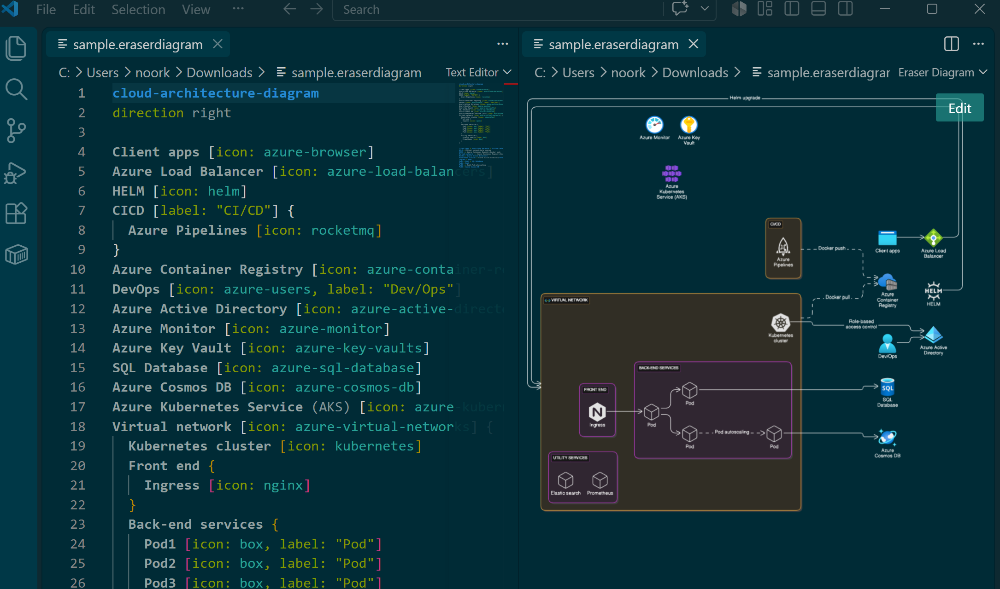


## **Les premiers pas sur Docker**
## **Déployer son premier conteneur**
## Première tentative
### Contexte
Maintenant qu'on a les outlis nécessaire, on va prendre en main **Docker** en **déployant** un premier **conteneur**.

### Objectifs
Déployer un serveur web (NGINX) sur le Docker Engine Local. Les manipulations suivantes seront entraînées:
* Lister les conteneurs et voir leur statut.
* Récupérer une image existante sur Docker Hu et construire un premier conteneur.
* Déployer le conteneur et tenter d'accéder à la page par défaut du serveur web.

## **2. Réalisation**
### Prérequis
* WLS2 est installé et opérationnel
Pour vérifier s'il l'est, ouvrir le terminal et taper la commande `wsl --status`
Ou `wsl -l -v` pour lister les distributions installées et leur version.
Ce n'est pas mon cas.

_WSL pour Windows Subsystem for Linux est un outil qui permet de faire tourner un environnemetn Linux
directement à l'intérieur de Windows. ça permet d'utiliser de vraies commandes Linux (bash,
ls, grep, etc) directement depuis mon invite de commande ou le terminal VSCode.
Il est essentiel pour faire marcher Docker qui a besoin d'un noyau Linux pour faire tourner
des conteneurs de manière fluide sur windows._

### Marche à suivre du prérequis
* Ouvrir PowerShll en tant qu'admin et executer la ligne de commande:
-- INPUT
`wsl --install`
-- OUTPUT
```
Téléchargement en cours : Sous-système Windows pour Linux 2.7.12
Installation en cours : Sous-système Windows pour Linux 2.7.12
Sous-système Windows pour Linux 2.7.12 a été installé.
Installation du composant facultatif Windows : VirtualMachinePlatform

Outil Gestion et maintenance des images de déploiement
Version : 10.0.26100.8972

Version de l’image : 10.0.26200.9168

Activation de la ou des fonctionnalités
[==========================100.0%==========================]
L’opération a réussi.
L’opération demandée est réussie. Les modifications ne seront pas effectives avant que le système ne soit réamorcé.
L’opération demandée est réussie. Les modifications ne seront pas effectives avant que le système ne soit réamorcé.
```

-- INPUT
`wsl --install ubuntu`

-- OUTPUT
`L’opération demandée est réussie. Les modifications ne seront pas effectives avant que le système ne soit réamorcé.`

* En cas d'erreur comme celle montrée par le prof dans le fichier source,
faire ça:

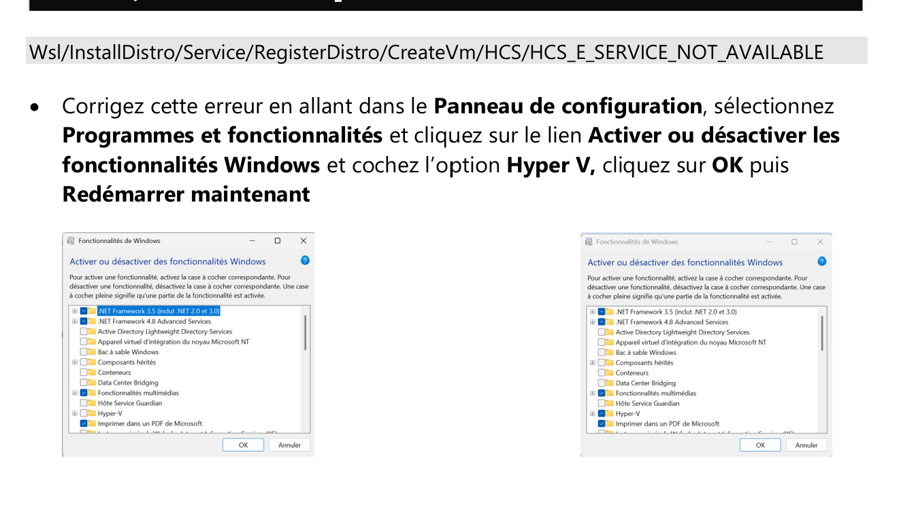

* Redémarrer l'ordinateur pour qu'il prenne en compte les modifications.

## **2. Installer Docker Engine**
* [Télécharger](https://docs.docker.com/engine/install/) 
* Télécharger la version pour Windows "[Docker Desktop fro Windows -x84 64](https://desktop.docker.com/win/main/amd64/Docker%20Desktop%20Installer.exe?utm_source=docker&utm_medium=webreferral&utm_campaign=docs-driven-download-win-amd64&_gl=1*1or7s3h*_gcl_au*MTA2MzkwNTI5Ni4xNzg3NDM3NDI1*_ga*MTE4NDE1MzE3Mi4xNzg3NDM3NDI1*_ga_XJWPQMJYHQ*czE3ODc0Mzc0MjUkbzEkZzEkdDE3ODc0MzgxMDQkajU4JGwwJGgw)"
* Lancer le fichier .exe, faire **ok** et attendre la fin de l'installation puis **cliquer** sur le bouton
"**quitter**".
* Lancer l'application **Docker Desktop** en la cherchant dans la barre de recherche windows.
* **Accepter** le contrat de license.
* Se **connecter**. Je l'ai fait avec Google. Mon username est noorkiaou.
* Vérifier son adresse email et ouvrir l'application.
* Docker Desktop est installé.
* Lancer ensuite **VSCode**
* C'est le symbole qui ressemble à ça **><** qui permets de se connecter à **WSL**.
En cliquant dessus on peut sélectionner **WSL** en haut de l'écran VSCode.
Preuve ici-bas:

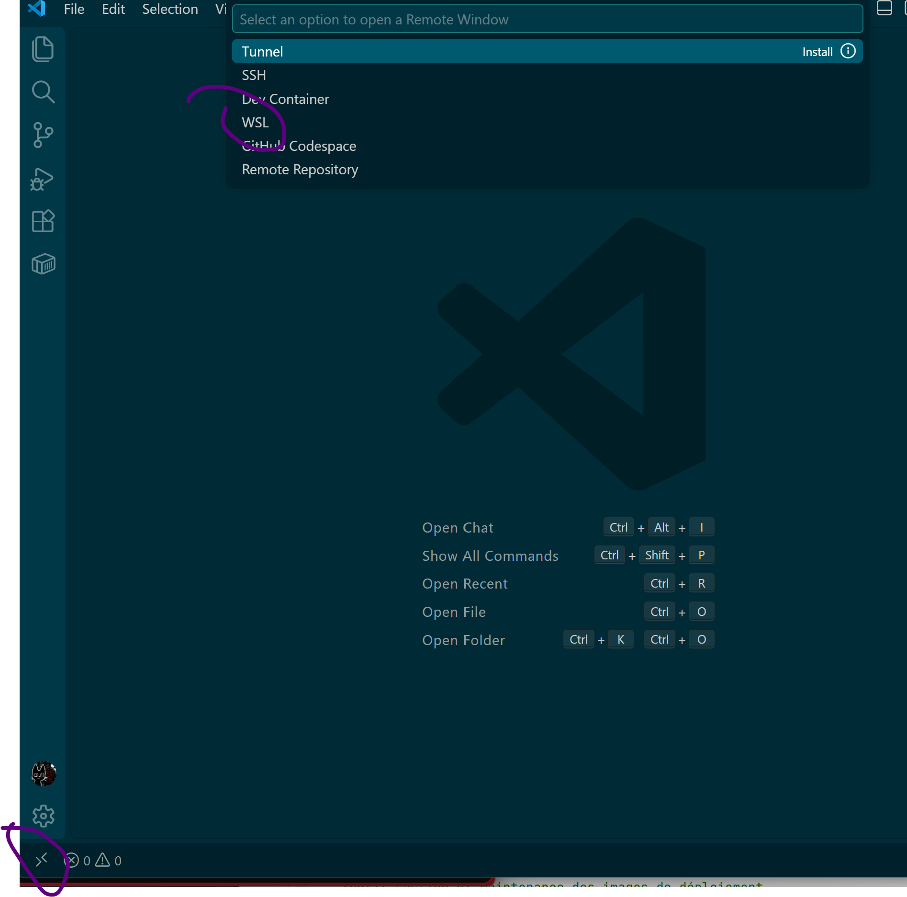

~~**Problème**: Quand j'essaie d'ouvrir **wsl** sur **VSCode**, j'ai un message d'erreur qui s'affiche.


* Cliquer sur **close WSL Window**
* Ouvrir mon terminal classique (c'est un windows **powershell**)
* Taper:
-- INPUT
`wsl`
-- OUTPUT
`A8:/mnt/host/c/Users/noork#`
ça nous connecte directement à l'**environnement Linux** via WSL.
* Fermer le terminal.
* Ouvrir VSCode manuellement.
* Cliquer sur >**<** pour Wsl
* Cette fois il y a deux options qui s'affichent en haut de l'écran de VScode:
-- OUTPUT
`Connect to WSL` qui n'a pas marché avant.
`Connect to WSL using Distro...`
* **Cliquer** sur le second (`Connect to WSL using Distro...`)
-- OUTPUT
`docker-desktop default distro`
`+Install New...`

**Explication du problème**:
Comme **docker-desktop** apparaît dans la liste, aucune autre distribution **Linux** n'est installée sur mon **WSL**.
**Docker Desktop** a besoin de WSL mais il en utilise actuellement une version interne et cachée appelée **docker-desktop**
uniquement pour faire tourner son moteur de conteneurs en arrière lant.
C'est pourquoi **VSCode** ne peut pas se connecter à **docker-desktop**, c'est pas fait pour coder,
il est juste un **moteur technique** pour **Docker**.
**Maintenant on abesoin d'une distribution Linux qui permette de coder.**~~


## **3. Accès au web**
### Objectif
* Récupérer l'image officielle [NGINX](https://hub.docker.com/_/nginx) pour Docker Source.

### Marche à suivre
* Pull l'image **NGINX** en tapant ce code sur le terminal **Powershell**:
-- INPUT
`docker pull nginx` dans mon **terminal** (**Pwershell** ou VSCode)
-- OUPTUT
```
Using default tag: latest
latest: Pulling from library/nginx
7eb55399d6de: Pull complete
5d480233f531: Pull complete
128fcc7b23b0: Pull complete
5508f6432d3e: Pull complete
26c307b5e35a: Pull complete
746b934a8960: Pull complete
f530c3e421fc: Pull complete
81dd0279e705: Download complete
3976f7b8a9d7: Download complete
Digest: sha256:8f029c543423e3eac6b08254718bc31eb75633b1e448026b6616927baa7d4bfe
Status: Downloaded newer image for nginx:latest
docker.io/library/nginx:latest
```

**Quelle est la version de l'image NGINX qui a été récupérée?**
* lister les images en tapant
-- INPUT
`docker images`
-- OUPUT
```
IMAGE          ID             DISK USAGE   CONTENT SIZE   EXTRA
nginx:latest   8f029c543423        241MB         66.2MB
```
On retrouve:
- le poids de l'image: 66.2MB
- La dernière Iso de NGINX

## **4.Déployer le conteneur NGINX - première tentative**
### Contexte
* On va demander à Docker de créer un conteneur avec l'image NGINX et de le lancer au premier plan
via la commande `docker run --name nginx-first-attempt nginx`.
* Le conteneur va s'exécuter directement dans le terminal et afficher tous ses messages de 
journalisation  (ses logs) en temps réel.

### Marche à suivre
* Lancer le terminal et taper:
-- INPUT
```
docker run --name nginx-first-attempt nginx
```
-- OUTPUT
```
/docker-entrypoint.sh: /docker-entrypoint.d/ is not empty, will attempt to perform configuration
/docker-entrypoint.sh: Looking for shell scripts in /docker-entrypoint.d/
/docker-entrypoint.sh: Launching /docker-entrypoint.d/10-listen-on-ipv6-by-default.sh
10-listen-on-ipv6-by-default.sh: info: Getting the checksum of /etc/nginx/conf.d/default.conf
10-listen-on-ipv6-by-default.sh: info: Enabled listen on IPv6 in /etc/nginx/conf.d/default.conf
/docker-entrypoint.sh: Sourcing /docker-entrypoint.d/15-local-resolvers.envsh
/docker-entrypoint.sh: Launching /docker-entrypoint.d/20-envsubst-on-templates.sh
/docker-entrypoint.sh: Launching /docker-entrypoint.d/30-tune-worker-processes.sh
/docker-entrypoint.sh: Configuration complete; ready for start up
2026/08/22 23:36:35 [notice] 1#1: using the "epoll" event method
2026/08/22 23:36:35 [notice] 1#1: nginx/1.31.4
2026/08/22 23:36:35 [notice] 1#1: built by gcc 14.2.0 (Debian 14.2.0-19)
2026/08/22 23:36:35 [notice] 1#1: OS: Linux 6.18.33.2-microsoft-standard-WSL2
2026/08/22 23:36:35 [notice] 1#1: getrlimit(RLIMIT_NOFILE): 1048576:1048576
2026/08/22 23:36:35 [notice] 1#1: start worker processes
2026/08/22 23:36:35 [notice] 1#1: start worker process 29
2026/08/22 23:36:35 [notice] 1#1: start worker process 30
2026/08/22 23:36:35 [notice] 1#1: start worker process 31
2026/08/22 23:36:35 [notice] 1#1: start worker process 32
2026/08/22 23:36:35 [notice] 1#1: start worker process 33
2026/08/22 23:36:35 [notice] 1#1: start worker process 34
2026/08/22 23:36:35 [notice] 1#1: start worker process 35
2026/08/22 23:36:35 [notice] 1#1: start worker process 36
2026/08/22 23:36:35 [notice] 1#1: start worker process 37
2026/08/22 23:36:35 [notice] 1#1: start worker process 38
2026/08/22 23:36:35 [notice] 1#1: start worker process 39
2026/08/22 23:36:35 [notice] 1#1: start worker process 40
2026/08/22 23:36:35 [notice] 1#1: start worker process 41
2026/08/22 23:36:35 [notice] 1#1: start worker process 42
2026/08/22 23:36:35 [notice] 1#1: start worker process 43
2026/08/22 23:36:35 [notice] 1#1: start worker process 44
```
La commande semble bloquée mais enfait le terminal est branché sur la sortie du conteneur.
Si on ferme le terminal, le conteneur s'arrêtera.

## **4.Déployer le conteneur NGINX - deuxième tentative**
### Contexte
* On va ouvrir un second onglet dans le terminal et taper `docker ps -a` pour interroger le
gestionnaire de Docker et lui demander de montrer tous les conteneurs qui exstent sur la machine
(qu'ils soient allumés ou éteins.)

### Marche à suivre
* Ouvrir un second onglet de terminal et lister les conteneurs répertorié:
  -- INPUT
```
docker ps -a
```
-- OUTPUT
```
CONTAINER ID   IMAGE     COMMAND                  CREATED         STATUS         PORTS     NAMES
cc0275322c63   nginx     "/docker-entrypoint.…"   3 minutes ago   Up 3 minutes   80/tcp    nginx-first-attempt
```
ça montre le conteneur **cc0275322c63** qu'on vient de créer 
et que le premier onglet du terminal maintient en vie en "up", donc allumé.
* Tenter de **contacter** le **serveur web** (qui écoute normalement sur le **port 80**, en **tcp**):
-- INPUT
```
curl localhost
```
-- OUTPUT
```
curl : Impossible de se connecter au serveur distant
Au caractère Ligne:1 : 1
+ curl localhost
+ ~~~~~~~~~~~~~~
    + CategoryInfo          : InvalidOperation : (System.Net.HttpWebRequest:HttpWebRequest) [Invoke-WebRequest], WebExcep
   tion
    + FullyQualifiedErrorId : WebCmdletWebResponseException,Microsoft.PowerShell.Commands.InvokeWebRequestCommand
```
**Probème numéro un:**
**curl** dans **PowerShell** est un raccourcis vers une autre commande interne (Invoke-WebRequest).
Je devais utliliser la commande `curl.exe localhost`
Ou j'aurais pu faire avec Cmder dès le début avec la commande `curl localhost` car il n'y aurait pas eu ce problème.

* deuxième essaie:
-- INPUT
```
curl.exe localhost
```
-- OUTPUT
```
curl: (7) Failed to connect to localhost:80 after 2260 ms: Could not connect to server
PS C:\Users\noork>
```

**Conclusion**:
**Problème numéro deux:**
_**Le port 80 du conteneur n'a pas de PATH qui mène à ma machine hôte pour l'instant. Mais il faut noter que le port 80 écoute effectiment.**_


## Stopper et supprimer le conteneur:
* Lister les conteneurs et récupérer le nom ou l'id du conteneur.
-- INPUT
```
docker ps -a
```
-- OUTPUT
```
CONTAINER ID   IMAGE     COMMAND                  CREATED         STATUS         PORTS     NAMES
cc0275322c63   nginx     "/docker-entrypoint.…"   3 minutes ago   Up 3 minutes   80/tcp    nginx-first-attempt
```

* On stop le **conteneur nginx-first-attempt** avec 
-- INPUT
* `docker stop nginx-first-attempt`
--OUTPUT
`nginx-first-attempt`

* On vérifie son état avec:
--INPUT
`docker ps -a`
--OUTPUT
```
CONTAINER ID   IMAGE     COMMAND                  CREATED          STATUS                          PORTS     NAMES
  982224d77152   nginx     "/docker-entrypoint.…"   13 minutes ago   Exited (0) About a minute ago             nginx-first-attempt
```
On voit quil est Exited.

* On le supprime avec 
-- INPUT
`docker rm nginx-first-attempt`
--OUTPUT
```
nginx-first-attempt
```

* On revérifie son état:
--INPUT
`docker ps -a`
--OUTPUT
`CONTAINER ID   IMAGE     COMMAND   CREATED   STATUS    PORTS     NAMES`

* Valider que l'image est toujours présente:
--INPUT
`docker images`
--OUTPUT
```
IMAGE          ID             DISK USAGE   CONTENT SIZE   EXTRA
nginx:latest   8f029c543423        241MB         66.2MB
```
Fin.
