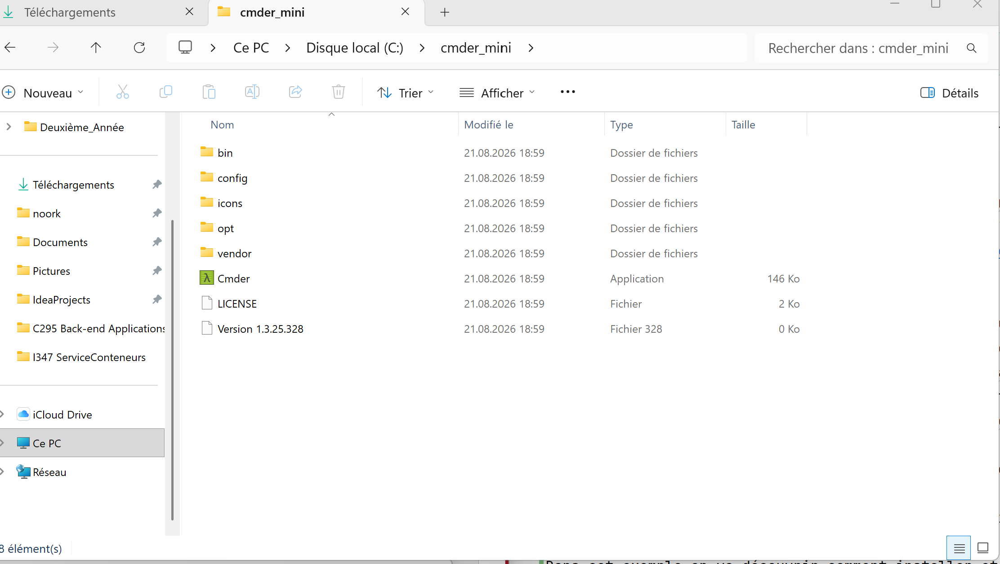
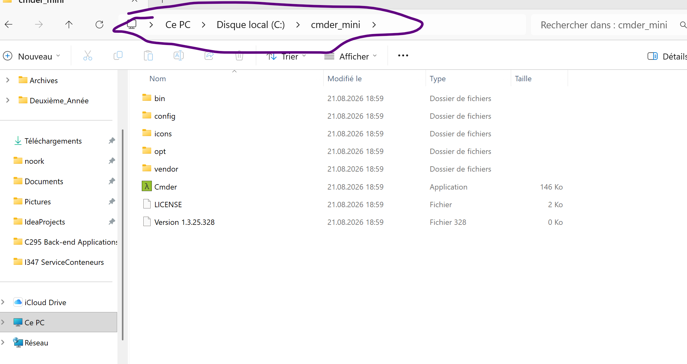
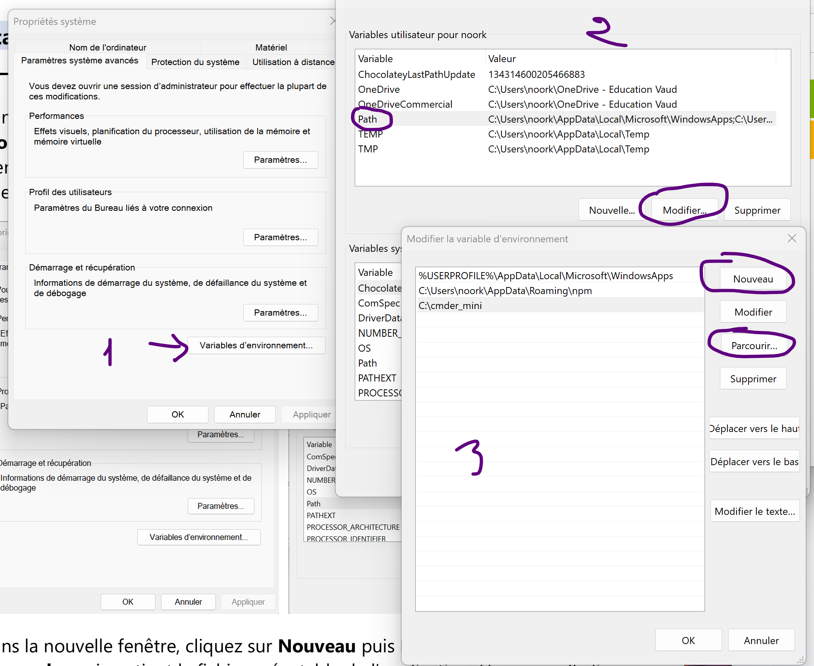
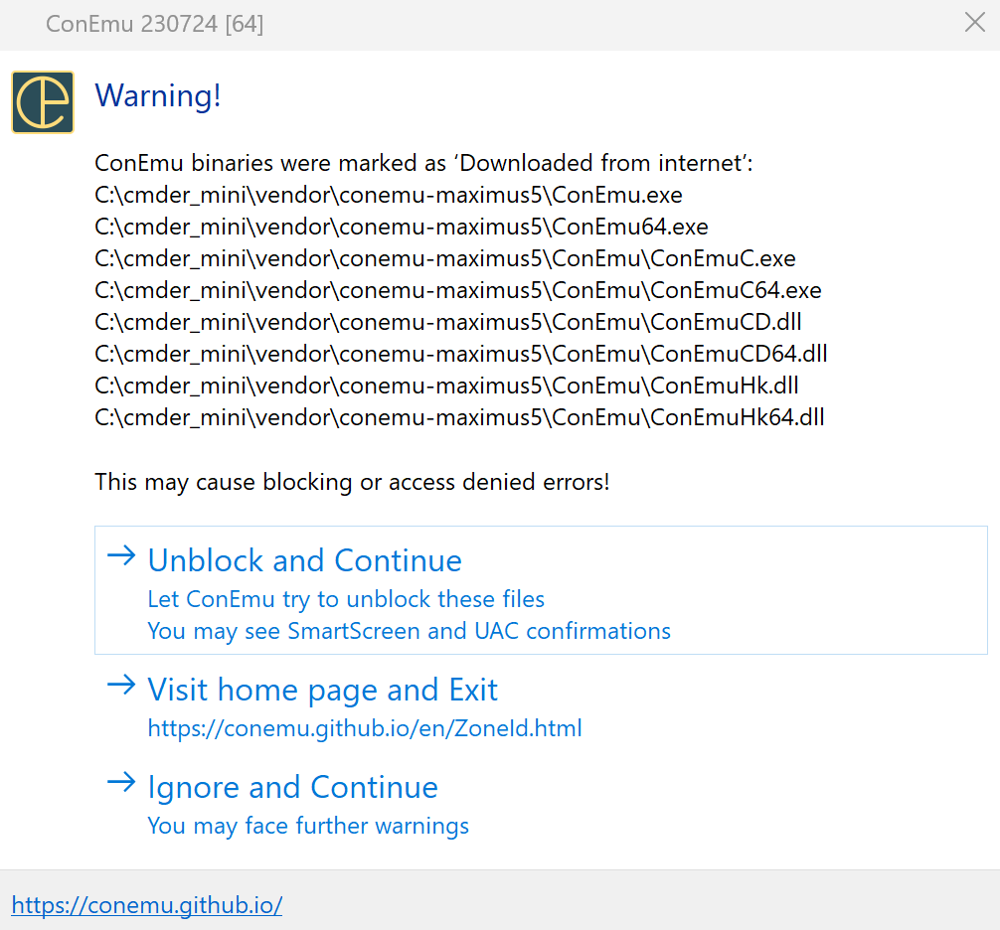
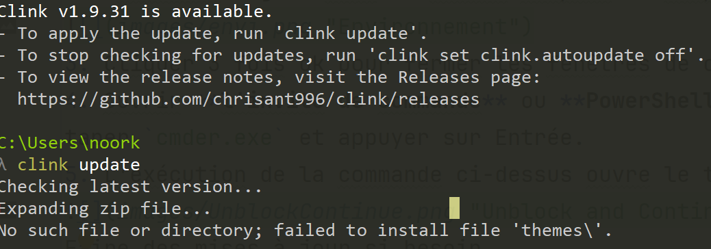
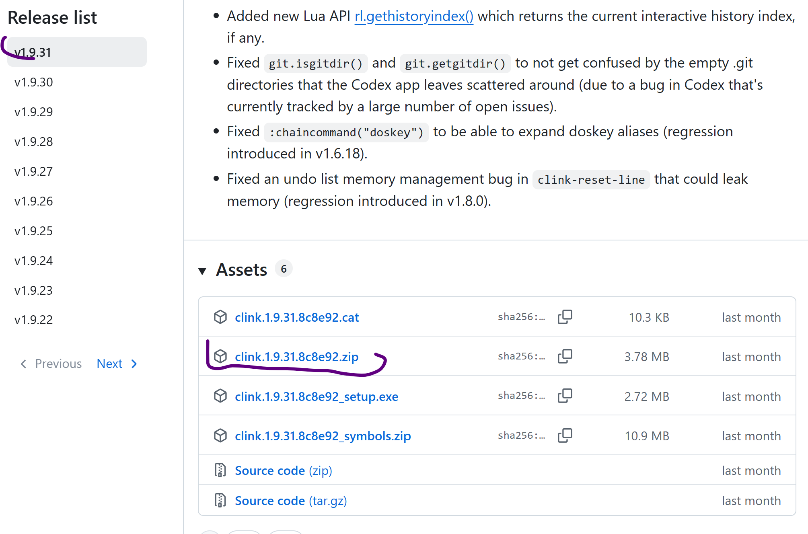
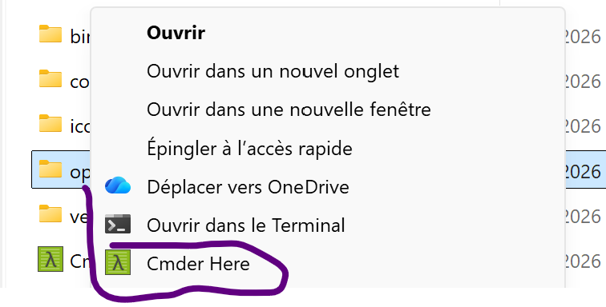
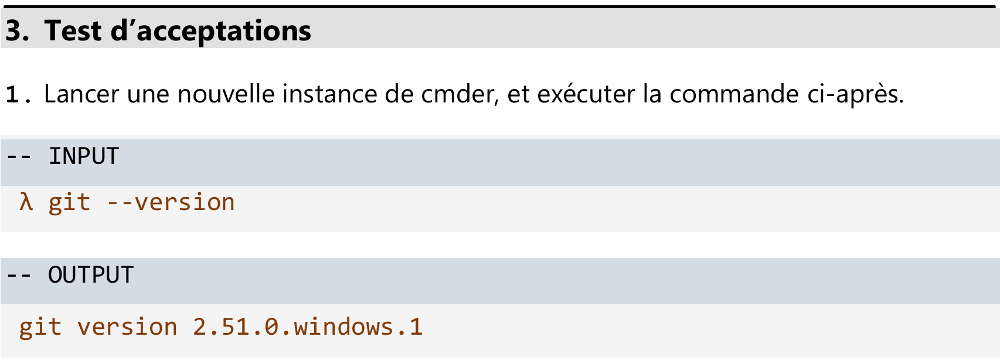

# 347Conteneurs
# Documentation d'installation de l'environnement de developpement.
## **Objectifs et consignes:** Cmder, Git, VSC, Docker Desktop.
--------------------------------------------------------------------------
## **Objectifs**
À l'aide des sources proposées ci-dessous, installer différents outils proposés:
* Cmdr,
* Git,
* Visual Studio Code,
* Docker Desktop.

## **Livrable**
La documentation d'installation favorise:
* Une documentation basée sur des lignes de commandes en mentionnant les INUTS et les OUTPUT attendus.
* Des captures d'écran lorsque les lignes de commmandes ne sont pas possible
* Une documentation de résolution d'éventuelles panne.

**Source du document initial:** `[Source](https://ivanskodje.com/how-to-set-system-path-environment-variable-in-windows-10/)`
                                             
## **Cmder – Utilitaire de ligne de commande.**
### Context  
Cmder est un logiciel créé à cause de la pure frustration face à l’absence de jolis  émulateurs de consoles sur Windows. 
C’est donc un  émulateur de terminal pour Windows.
### Ce qu'on va faire
* **`[Télécharger](https://cmder.app/)`**
* Choisir la version mini (nous installerons *git* dans un second temps)
* Bien mettre à jour la variable d'environnement "*PATH*"
* En t'aidant de **`[cette documentation](https://github.com/cmderdev/cmder#shortcut-to-open-cmder-in-a-chosen-folder)`**, 
* fais en sorte que "*cmder*" s'ajoute au menu contextuel de l'explorateur de Windows. 

### Test d'acceptations
* Valider que la variable "PATH" a bien été mise à jour:
Utiliser la commande *`cmder`* pour ouvrir le prompt cmder.
(Dans l'exemple du prof il fallait mettre run cmder mais run n'est pas reconnu)
* Il faut valider que les raccourcis cmder ont bien été intégré dans l'explorateur de windows:
Pour ça il faut faire un clique-droit sur un dossier quelconque et *Cmder Here* sera dans les options.

## **1.Cmder - Installation de *Cmder* ** et paramétrage de variable d'environnement**
### Context
L'objectif est de pouvoir ouvrir/lancer *Cmder.exe* via laligne de commande, peut importe le chemin du répertoire.
En effet, sans l'ajout de la *variable d'environnement du chemin système*, 
il n'est pas possible d'exécuter Cmder.exe en dehors du fichier dans lequel il se trouve.
Dans cet exemple on va découvrir comment installer et exécuter **cmder** à partir de la ligne de commande.
On peut le faire avec n'importe quel fichier exécutable.

### Marche à suivre
1. Télécharger le *Cmder.exe* en version mini et le décompresser. 
Voici une image d'à quoi ressemble le dossier décompressé.
 


2. Ouvrir l'invite de commande en tant qu'administrateur 
(en faisant un clique-droit sur le terminal dans l'explorateur windows).
Avec  le terminal, se positionner dans le dossier cmder avec le chemin d'accès via la commande
`cd C:\cmder_mini` Là où j'ai mis "C:\cmder_mini", il faut le remplacer par le chemin d'accès du dossier sur ton ordi.
Tu peux le trouver en allant sur le dossier cmder, en cliquant sur la partie sélectionnée sur l'image et en copiant le chemin d'accès qui se trouve en haut.

3. 
 
~~3. Ensuite il faut sauvegarder le chemin d'accès en écrivant cette ligne de code `.\cmder.exe /REGISTER ALL`~~  
~~Et enfin lancer la commande `cmder.exe` pour ouvrir l'app.~~
### PROBLÈME! 
ça ne marche pas car la variable d'environnement PATH n'a pas encore été configurée
pour indiquer à windows où se trouve le dossier `"C:\cmder_mini"`. On passe donc à la partie 2.

## **2.Cmder - Paramétrage de variable d'environnement** 
### Contexte
Les **"Variables d'environnement système"**, 
appelée la variable d'environnement du chemin système,
est utilisée dans le contexte de l'exécution des fichiers.exe via la ligne de commande 
ou la fenêtre PowerShell.

### Marche à suivre
* Même étapes qu'avant: télécharger en mini, décompresser, se souvenir du chemin d'accès.
On l'a déjà fait donc je le compte pas.
1. Dans le champ **Rechercher** du menu Démarrer, taper *envi* 
et ouvrir la page **Modifier les variables d'environnement système**, puis sélectionner Variable d'environnement
Dans la nouvelle fenêtre, aller dans le menu Variables système.
Sélectionner la ligne commençant par **PATH** et cliquer sur **Modifier**.
2. Dans la nouvelle fenêtre, cliquer sur **Nouveau** 
puis **Parcourir** pour sélectionner le dossier **cmder** qui contient le fichier exécutable de l’application. 
Une nouvelle ligne  avec le chemin complet de l’application cmder s’ajoute à la liste 



3. Cliquer 3 fois ok pour fermer les fenêtres de configuration ouvertes.
4. Ouvrir **l'invite de commande** ou **PowerShell**. Si c'est déjà ouvert, faut le refermer et le rouvrir (toujours en admin).
taper `cmder.exe` et appuyer sur Entrée.
5. L'exécution de la commande ci-dessus ouvre le terminal **Cmder**.


Faire des mises à jour si besoin.
_6. Dans le cas d'une mise à jour qui ne marche pas, comme dans le cas ici-bas._

__

_Ce cas précis démontre un problème connu lors de la mise à jour d'anciennes versions de Clink._
_La mise à jour a partiellement fonctionné mais l'ancien programme de mise à jour contient un bug:_
_Il ne sait pas gérer le sous-dossiers themes\ qui a récemment été introduit._
_(Le code de mise à jour s'exécute à partir de l'ancienne version installée sur la machine.)_
Pour finaliser la mise à jour:
* Fermer Cmder.
* Ouvrir une simple invite de commande en tant qu'administrateur
~~* Aller dans le dossier où Clink est installé, il est normalement dans le dossier **vendor**~~ 
~~dans le dossier **Cmder_mini** qu'on a décompressé avant.~~ _ça n'aura servi à rien_.
* Aller sur la [page des releases GitHub de Clink](https://github.com/chrisant996/clink/releases)
* Télécharger le fichier `.zip` de la dernière version



* Le décompresser (via extraire tout)
* Ouvrir le fichier téléchargé, sélectionner tout ce qu'il y a dedans (par exemple en faisant CTRL + A)
* Copier tout les fichiers et les coller dans le dossier **Clink** qui se trouve dans le dossier **Cmder_mini**.
* Quand ça propose de **remplacer** les fchiers qui ont le même noms, choisir **Remplacer les fichiers dans la destination**. C'est ça qui va tout mettre à jour.
* Ouvrir **Cmder**
* Taper `clink update`
C'est à jour.

## **3.Cmder - Raccourci pour ouvrir Cmder dan un dossier choisi**  
### Marche à suivre
1. ouvrir un terminal en tant qu'administrateur.
2. Accéer au répertoire dans lequel on a placé _Cmder_ 
En remettant le bon chemin d'accès "C:\cmder_mini" via la commande
`cd C:\cmder_mini` dans le terminal en mode admin.
3. Exécuter `.\cmder.exe /REGISTER ALL`
C'est cette commande qui va permettre l'option d'ouvrir Cmder automatiquement 
lors d'un clique-droit dans un dossier ou sur le bureau de l'explorateur Windows.
4. Dans une fenêtre d'explorateur de fichiers, faites un clic-droit dans ou sur
un répertoire pour voir "Cmder Here" dans le menu.

### 3.Cmder - Test d'acceptation
1. Valider que l variable "PATH" a bien été mise à jour en tapant cette commande `cmder`
Normalement ça va ouvrir le prompt cmder.
2. Valider que les raccourcis cmder ont bien été intégré dans l'explorateur de Windows


        
## **Gestion de versioning**
** 1. Git - outil de gestion de version**
### Context
Git est un système de contrôle de version distribué gratuit et open source conçu 
pour gérer tout, des petits aux très grands projets, avec rapidité et effcacité.
* **[Télécharger](https://git-scm.com/)** 
* Prendre la version *"Standalone Installer"* 
* Laisser tous les paramètres par défaut (durant l’installation) 

## **2. Git - installer** 
### Marche à suivre
1. Lancer l'exécutable et ~~cliquer sur Entrée 13 fois de suite.~~
* *À noter que certains des paramètres par défaut ne sont plus exactement les mêmes que sur la source originale.*
* *Il se peut aussi que l'exécutable saute toutes les entrées à part la proposition initiale de l'installation.*
2. Cliquer sur Install et attendre qu'elle s'installe.

### Tests d'acceptations
* Petit contexte rapide:
Un exemple de test d'acceptation:



Dans la rédaction de codage de Cmder, on écrit --INPUT ou --OUTPUT pour expliquer
ce qui est tapé ( -- INPUT) et ce que la console affiche ( ---OUTPUT).
Le symbole λ n'est pas à taper, Il est déjà sur Cmder.
C'est une norme qui est propre à Cmder pour faire joli.

1. Lancer une nouvelle instance de Cmder et exécuter la commande ci-dessous.
_UNIQUEMENT CE QUI EST ENTRE ``_
-- INPUT 
`git --version`

--OUTPUT
`git version 2.55.0.windows.5`

2. Se rendre dans un répertoire dédié pour le développement <pathToMyDevFolder>
et exécuter la commande `git init` pour initialiser un nouveau dépôt.
* Créer un répertoire dédié en tapant `mkdir Projet347Conteneurs` (ou n'importe quel nom). 
**mkdir** vient de _Make directory_, ce qui veut dire créer un dossier.
* Puis taper `cd Projet347Conteneurs` pour switcher sur ledit dossier. 
**cd** pour change directory.
* taper `git init` pour créer un nouveau dépôt **Git** à partir de là on pourra l'envoyer sur Github..
On reçoit la réponse `Initialized empty Git repository in C:/Users/noork/Projet347Conteneurs/.git/`
Maintenant on est `C:\Users\noork\Projet347Conteneurs (master)`
3. Lister le contenu du répertoire dans lequel Git a été initialisé.
--INPUT
`ls -la` (ls pour liste les fichiers et -la pour afficher tous les fichiers, y compris les cachés) 
--OUTPUT
```total 12
drwxr-xr-x 1 noork 197609 0 août  21 22:42 ./
drwxr-xr-x 1 noork 197609 0 août  21 22:37 ../
drwxr-xr-x 1 noork 197609 0 août  21 22:42 .git/```
